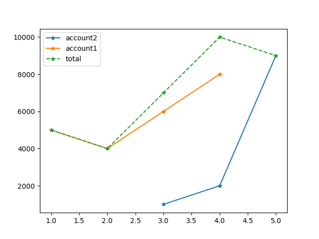

savings\_ninja
=============

Overview
-------

savings\_ninja is a tool for plotting account changes over time, using 
[matplotlib](https://github.com/matplotlib/matplotlib). The program is currently very
much a prototype and will almost certainly change a lot in terms of functionality, user
interface, etc. (for example, it currently doesn't take any command line arguments, but
it almost certainly will at a later stage in development)

File formatting
---------------

savings\_ninja will read files under the directory `execRoot/accounts`, where `execRoot`
is the directory where the executable python file `savins_ninja` is stored.

First of, I'm not an economist, so there's a good chance I use economic terms incorrectly.
Feel free to raise an issue if you think I should rephrase something.

Every file will represent one savings account (or stock, or whatever asset you want
really). The first line will contain an integer representing the first month in chronology
that the account contained any equity. Every line after that represents the value that the
account/asset had in the next chronological month.

Example
-------

The following is an example of what an account file could look like:

    1
    5000
    4000
    6000
    8000

In this case, the equity of the account is getting tracked from month `1`. In the first
month, the account had an equity of `5000` (dollars/swedish crowns/bitcoin/space credits/
whatever currency you have chosen to measure equity in). In the second month, it had
an equity of `4000`. In the third month it had an equity of `6000`, and in the 4th month
it had an equity of `8000`.

If there is another file in your accounts directory that looks like this:

    3
    1000
    2000
    9000

Then it had no value before the third month, during which it had an equity of `1000`.
In the 4th month it had an equity of `2000` and in the 5th month it had an equity of
`9000`.

When run, savings\_ninja will plot one line going through months `1` through
`4` on the `x`-axis, and the months with values `5000`, `4000`, `6000` and `8000` on the
`y`-axis for each respective month on the `x`-axis. It will plot another line going
through moths `3` through `5` on the `x`-axis, with values `1000`, `2000` and `9000`
on the `y`-axis. Finally, it will also plot a third line showing the toal equities over
the months `1` through `5`. There will also be a legend labeling the lines according to
the names of the files they represent (the last line will simply be labeled "`total`").

This is what the resulting plot would look like:

